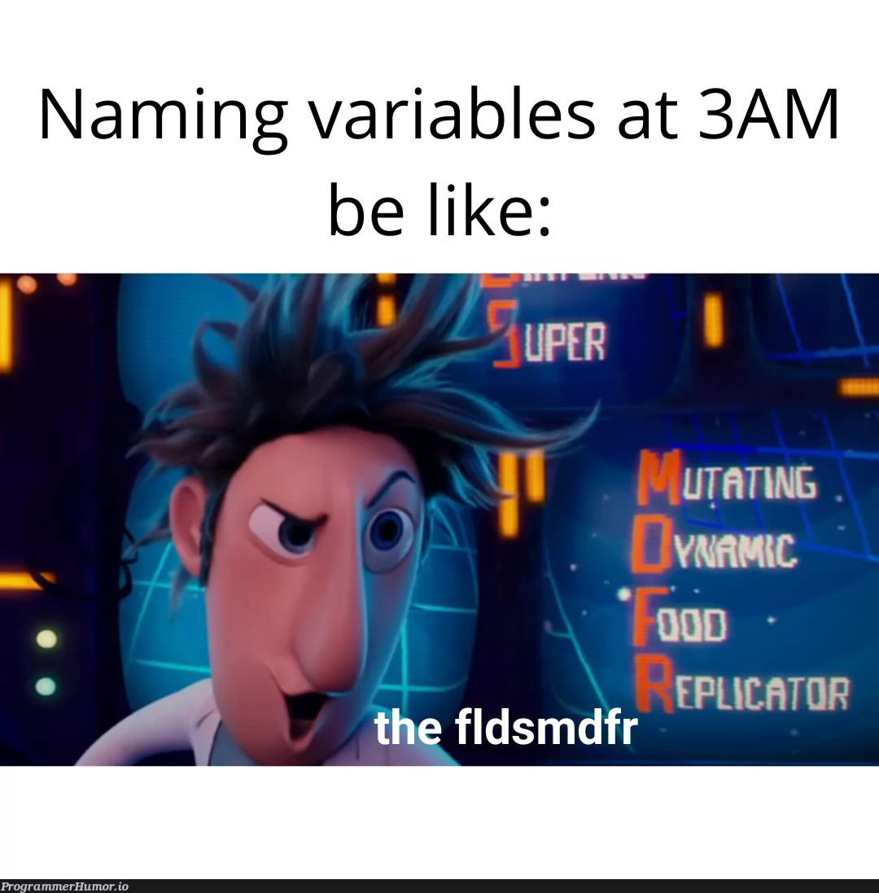

# Hi, I’m @cyprich 
  
👶🏻 Born in 2003  
🌍 Living in Prievidza, Slovakia  
🎓 Studying Information and Network Technologies at University of Žilina  
📖 *"When I wrote this code, only god and I knew how it worked. Now only god knows it!"*  

## Programming

Born to be [Python 🐍](https://github.com/cyprich?tab=repositories&q=&language=python) developer, forced to program in [Java ♨️](https://github.com/cyprich?tab=repositories&q=&language=java)  
Tried [Web Development 🌐](https://github.com/cyprich/cyprich.github.io), decided to switch to [C++ 🖥️](https://github.com/cyprich?tab=repositories&q=&language=c%2B%2B)  

## Interests
🖨️ 3D Printing & [Modelling](https://www.printables.com/@cypo)  
🛹 Skateboarding  
⛸️ Skating  

## Feel free to contact me  
| E-Mail | [cypooriginal@gmail.com](mailto:cypooriginal@gmail.com) |
|-|-|
| Instagram | [@bordel.pruser.margarin](https://www.instagram.com/bordel.pruser.margarin/) |
