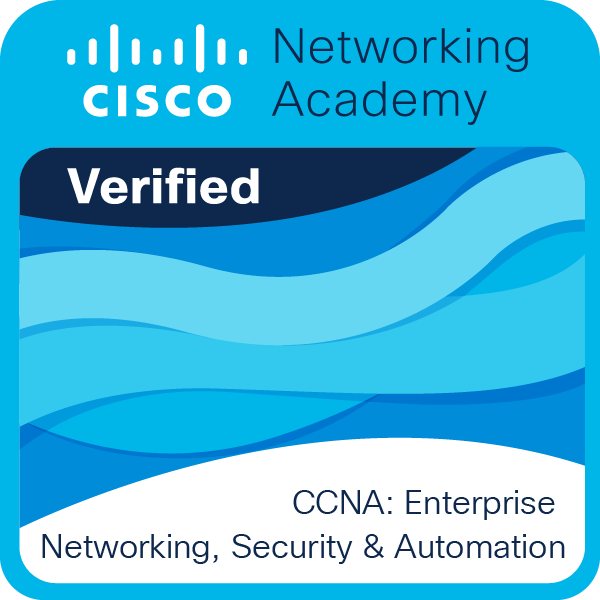
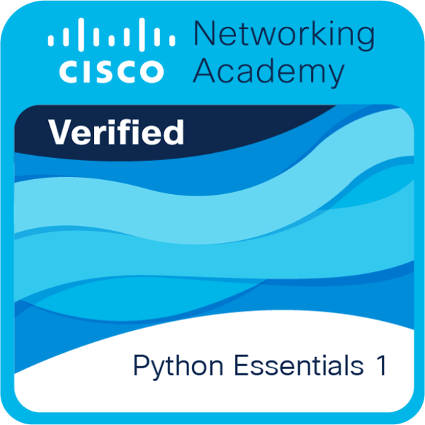
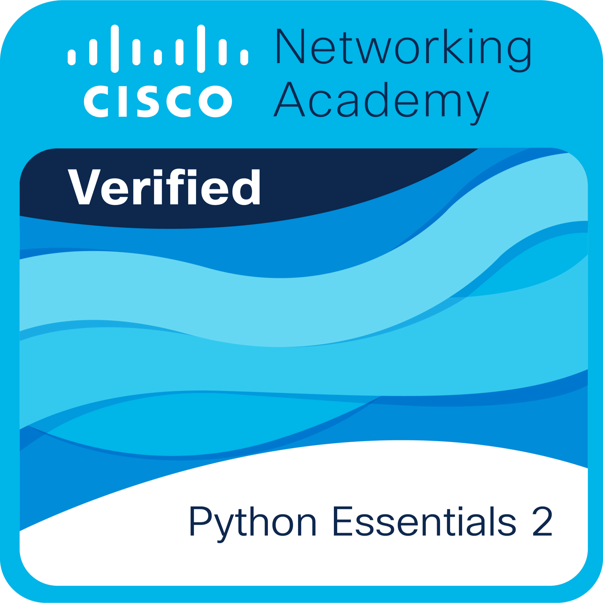
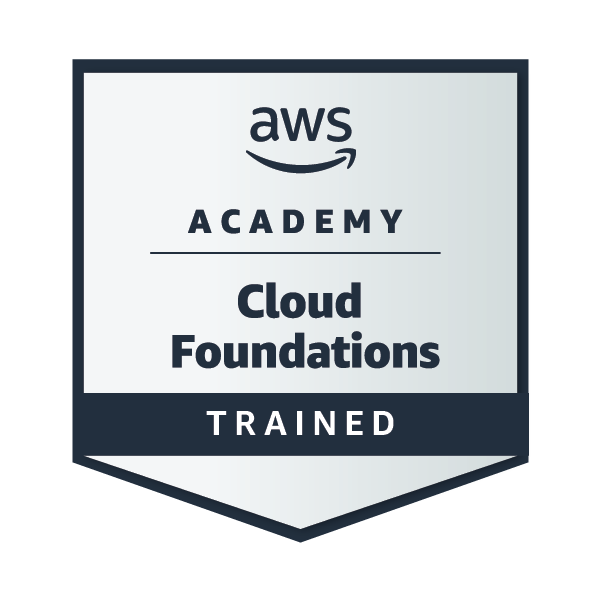

# 👋 Hi there, I’m @cyprich

🎓 Studying Information and Network Technologies at University of Žilina  
💻 Passionate about Linux, programming, 3D printing and building useful tools  
🌍 Living in Prievidza, Slovakia

## 🛠️ Tech & Tools I use

- **Languages**: Python · Rust · C++ · C# · Java · Bash
- **Frameworks**: Actix Web · Flask · React · Tailwind CSS
- **Databases**: PostgreSQL · SQLite · Oracle
- **Embedded**/**IoT**: ESP32 · Arduino · Raspberry Pi · MicroPython
- **Other tools**: Git · GitHub · Docker · Docker Compose · Markdown

## 📜 Courses & Certifications

- Cisco Certified Network Associate (CCNA)
  - CCNA 1 - Introduction to Networks
  - CCNA 2 - Switching, Routing and Wireless Essentials
  - CCNA 3 - Enterprise Networking, Security and Automation
- NDG Linux Essentials
- Certified Entry-Level Python Programmer 1 & 2 (PCEP)
- AWS Academy Cloud Foundations
- Cisco DevNet Associate

    
    
    
    

## 🌱 Fun Facts

- I run my own home server for Minecraft, Web apps and bunch of other self-hosted stuff
- Fluent in Linux, prefers command-line over GUI for most things
- Started coding in February 2020

## 📫 Contact

- **E-Mail**: [cypooriginal@gmail.com](mailto:cypooriginal@gmail.com)
- **Instagram**: [@bordel.pruser.margarin](https://www.instagram.com/bordel.pruser.margarin/)

---

📖 _"Code, break, learn, repeat"_
